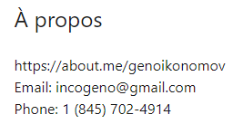
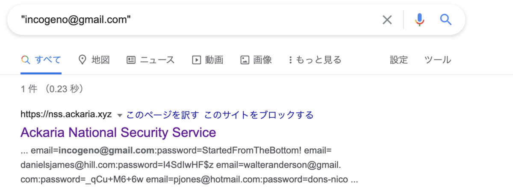

# Data Breach

  

#### Oh no !  Geno's email was involved in a data breach ! What was his password?

This is typically an OSINT challenge where we only have to use our search engine or data breach checking tool like h8mail or the harvester or Infoga. 

let's back to the Geno's linkedIn page 

As we can see, we have the email,

let's Google dork this email 

Here we go we have his password and this is also the flag : RS{StartedFromTheBottom!}
