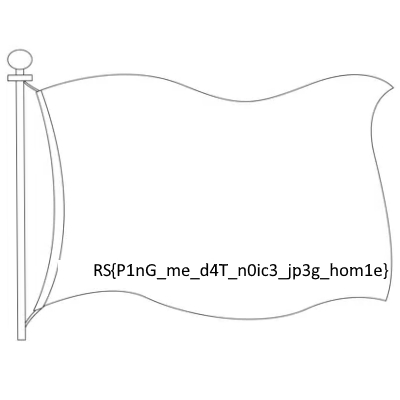

# Challenge Name: IFTPP


   


*Dang that's a big ping*

*-degenerat3*


## Detailed solution

This challenge give us a pcap to analyze with a hint on the presence of a big ping. Using Wireshark we can easily find a document requested by the client with the IP address 192.168.206.136 :

```
GET /rfc.txt HTTP/1.1
Host: 192.168.206.136:8080
User-Agent: curl/7.68.0
Accept: */*

HTTP/1.0 200 OK
Server: SimpleHTTP/0.6 Python/3.7.3
Date: Thu, 08 Apr 2021 06:53:17 GMT
Content-type: text/plain
Content-Length: 9439
Last-Modified: Sun, 04 Apr 2021 23:41:12 GMT

Insecure File Transfer Over Ping                            degenerat3
Request for Comments: 7370848080                          RITSEC Corp.
Category: RITSEC CTF Track                                  April 2021
ISSN: 2070-1721

            Insecure File Transfer Protocol over Ping (IFTPP)
                
Abstract
    This document defines the standards for implementation of IFTPP
    communications, which allows for encrypted file transfer over 
    ICMP. This protocol is a joke and its method of key generation and    
    encryption is horribly insecure. Please do not implement this 
    outside of CTF or joke scenerious, and please do not attempt to 
    send any sensitive data via this method.
    

Status of This Memo
    
    This is an RITSEC CTF Track document.
    
    This document is a product of the Radical Information Team Cyber 
    Intelligence Association. It represents the consensus of the 
    RITCIA community. It has received public review and has been 
    approved for publication by the Technology House of Intelligence 
    and Cyber Communications (THICC).  Further information on Internet 
    Standards is available in Section 2 of RFC 6789666982.

    Information about the current status of this document, any errata,
    and how to provide feedback on it may be obtained at 
    http[:]//lol[.]jk/idontwant/yourfeedback. 
```

This document is in fact a pseudo RFC which define a new protocol : IFTPP. We can then use the information given to implement a script that decode packet using this protocol and find the flag.

The script will need some tweaking until it works because the specification is not very clear for example in the separation between the field but we will finally obtain the flag

## Flag

