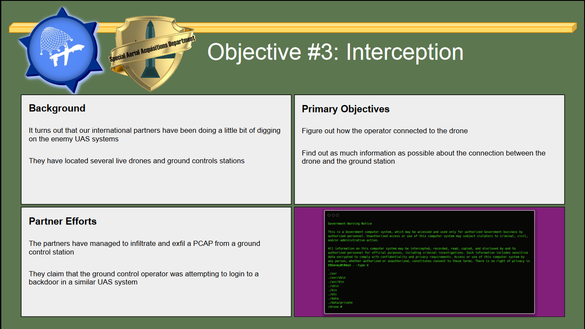
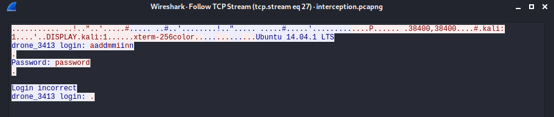
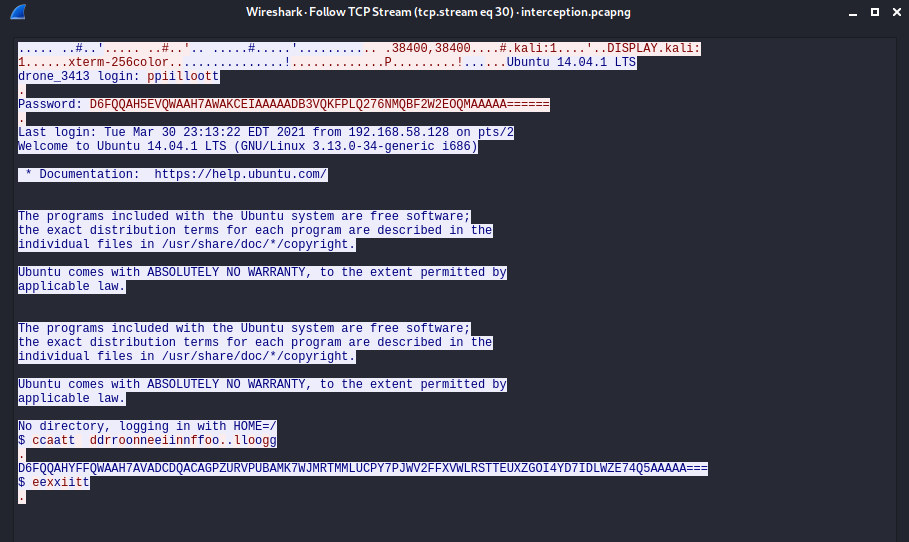

# BIRDTHIEF: Interception

   

*Read the slide deck for more information*

*Flag format RITSEC{}*

## Detailed Solution

This challenge is a part of the BIRDTHIEF series, the instructions are taken from the same pdf

The goal is to find traces of connections to the drone in the interception.pcapng file given alongside the pdf.

Loading the file in Wireshark and using the string search tool reveal that multiple unsuccessful DNS requests are made to the `drone_3413.localdomain` domain name from 192.168.58.129.
Using the display filter `ip.src==192.168.58.129` shows the activity of this host, taking the DNS traffic out with `&& !dns` shows TCP connections with 192.168.58.128.

Displaying the first TCP streams shows a failed login attempt on the drone

Whereas the second streams is much more interesting

Here the login has been successful, the operator even display the content of the droneinfo.log file.
Some letters are doubled because they were sent once by the operator and sent back to his distant terminal by the drone.
The password and file content seems encrypted in regular base 32 : the characters are all upper case, the numbers don't go higher than 7 and lower than 2 and there is some '=' padding. 
However decrypting it through base32 does not give anything intelligible.
A quick file analysis will tell that those are in fact gzip compressed bytes, restoring them with gunzip gives the flag.

## Flag

password : ritsec

droneinfo.log : RITSEC{Dr0n3_ar3_rea11y_c00l}
