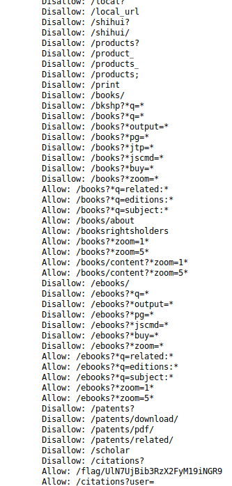
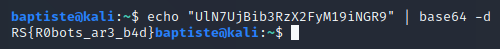

# Robots

  

#### Robots are taking over. Find out more.

After a dirsearch bruteforce we had a status 200 for robots.txt.

As we can see we have "/flag/UlN7UjBib3RzX2FyM19iNGR9" it seems to be encoded in base64 

We opened a terminal then we tried to decode this and we get the flag.s

