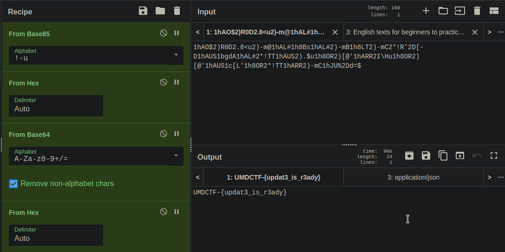

# Comuputer Troubles


*Help! My computer keeps sending me encoded alerts! What is it trying to tell me?*\
*author: sydocon*\
*score: 2/10*

The string to decode from message.txt
```
xxd -c 10 -g 5 encrypted                                                                                                                                       2 ⨯
00000000: 3168414f24 3229523044  1hAO$2)R0D
0000000a: 322e383c75 32292d6d40  2.8<u2)-m@
00000014: 3168414c23 3168384273  1hAL#1h8Bs
0000001e: 3168414c23 32292d6d42  1hAL#2)-mB
00000028: 3168384c54 32292d6d43  1h8LT2)-mC
00000032: 322a215227 32445b2d44  2*!R'2D[-D
0000003c: 3168415553 3162676441  1hAUS1bgdA
00000046: 3168414c23 322a215454  1hAL#2*!TT
00000050: 3168415553 32292e2475  1hAUS2).$u
0000005a: 3168384f52 32295b4027  1h8OR2)[@'
00000064: 3168415252 32495c4875  1hARR2I\Hu
0000006e: 3168384f52 32295b4027  1h8OR2)[@'
00000078: 3168415553 31635b4c27  1hAUS1c[L'
00000082: 3168384f52 322a215454  1h8OR2*!TT
0000008c: 3168415252 32292d6d43  1hARR2)-mC
00000096: 31684a5525 3244643d24  1hJU%2Dd=$
```

## Detailed solution

```
ciphey -f encrypted 
Result 'UMDCTF-{updatE is rEady}' (y/N): y
Format used:
  ascii85
  utf8
  hexadecimal
  base64
  utf8
  hexadecimal
  atbash
  reverse
  atbash
  leetspeak
  atbash
  reverse
  atbash
Final result: "UMDCTF-{updatE is rEady}"
```



## Flag

UMDCTF-{updat3_is_r3ady}