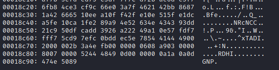

# Not Slick

*My friend always messes with PNGs.... what did he do this time?*
*author: itsecgary*
*score: 3/10*

## Detailed solution

The given file has the png extension but does not have a valid png signature.
I was going to use xxd to have a better view of the file and remarked that the dump ended with "GNP.", the png signature in reversed.

I simply reversed the file with cyberchef and saved it to reversed.png.

## Flag

UMDCTF-{abs01ute1y_r3v3r53d}